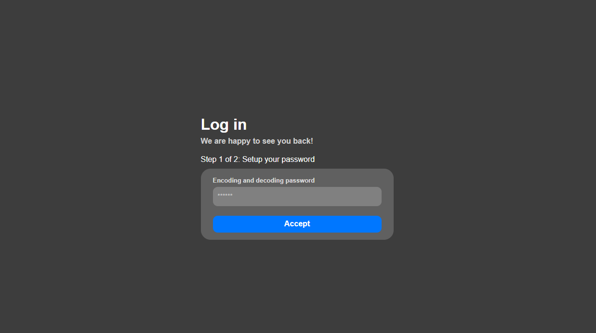
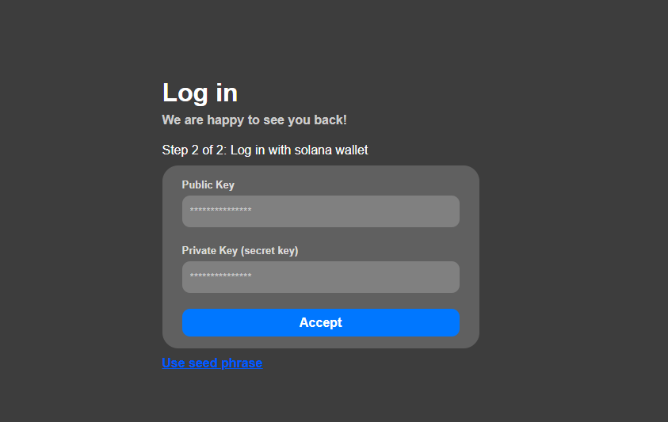

Soltransfers is an app to make transfers in the solana network, you can make a one-time transaction or you can "program" a periodic transaction to another wallet (e.g once a month send 15 USDC).
The core of this proyect is the original [Soltransfers](https://github.com/ProcapYT/soltransfers) proyect I made.

## Normal usage
The usage of the app is not too complex.

### Login
The login will ask for a password (to encrypt the wallet so no one can access it) and the wallet, with a public key and a private key or with the seed phrase (12 words).




### One-time transactions
Really simple, just selec the token, amount and reciever address and click send. You will also be given a link to all the details of the transaction on [Solscan](https://solscan.io)

### Periodic transactions
To set up a periodic transaction go to the token you want to send and select "periodic transaction" intead of "one time transaction", now select when the transaction is going to be made and send it.
To see the periodic transactions already set up on the top menu go to "Periodic Tx" and on the menu you can edit, delete and disable temporarilly the transaction.
While the app is not running (not even on the background) and you open it again it will show you what periodic transactions it's missed (if there are) so you can manage them.

## Dev usage

### Requisites
- Node.js 20.x.x^ [Node JS Download](https://nodejs.org/en/download)
- Npm.js 10.x.x^ Automatically installed with Node.js

### Set up
- Create a `fontawesomeLoader.js` on the directory `public/fontawesomeLoader.js` and get a fontawesome kit (it can be the free version) from [Fontawesome Kits](https://fontawesome.com/kits), now, inside the `fontawesomeLoader.js` file put this code:
```js
const $script = document.createElement("script");
$script.src = "https://kit.fontawesome.com/your_kit.js"; // Put here the link to the js file
$script.crossOrigin = "anonymous";
document.head.append($script);
```

- Install all dependencies with: `npm install` or `npm i`

> [!WARN]
> The app has not been tested on macOS due to unavailability of macOS hardware

### Start
- Start the app: `npm start` or `npx electron src/main.js` (starting the app this way will automatically open the dev tools)

### Build
- To build the app into an installer, executable... Do this:
    - Windows (.exe installer): `npm run build-win`
    - Windows: `npx electron-builder --win [build-type]`
    - Linux (.deb): `npm run build-linux`
    - Linux: `npx electron-builder --linux [build-type]`
    - MacOS: `npx electron-builder --mac dmg`

- To customize your own build type go in the package.json and modify the `"build"`. It should look something like this:
```json
{
    "build": {
        "appId": "com.sam.soltransfers",
        "productName": "Soltransfers",
        "win": {
            "icon": "icon/256x256.png",
            "target": "nsis"
        },
        "nsis": {
            "oneClick": false,
            "perMachine": false,
            "allowToChangeInstallationDirectory": true
        },
        "mac": {
            "target": "dmg",
            "icon": "icon/256x256.png"
        },
        "linux": {
            "target": [
                "deb"
            ],
            "icon": "icon",
            "maintainer": "Samuel Pedrera",
            "description": "A program that opens executables through a GUI",
            "category": "Utility",
            "packageCategory": "utility"
        }
    },
}
```

## License
This proyect is licensed under the [MIT License](LICENSE).

## Used resources
- Icons from [Flaticon](https://flaticon.com), designed by:
    - Logo: [bouzix](https://www.flaticon.com/authors/bouzix) - License [CC BY 4.0](https://creativecommons.org/licenses/by/4.0/)

- Icons from [Font Awesome](https://fontawesome.com) - License [CC BY 4.0](https://creativecommons.org/licenses/by/4.0/)

- APIs and Platforms:
    - [Jupiter Aggregator](https://jup.ag) - Solana-based swap aggregator ([Docs](https://station.jup.ag))
    - [Solana Web3.js](https://github.com/solana-labs/solana-web3.js) - License [MIT](https://github.com/solana-labs/solana-web3.js/blob/master/LICENSE)
    - [Solana SPL Token](https://github.com/solana-labs/solana-program-library/tree/master/token/js) - License [MIT](https://github.com/solana-labs/solana-program-library/blob/master/LICENSE)

- Libraries and Frameworks:
    - [Electron](https://www.electronjs.org/) - License [MIT](https://github.com/electron/electron/blob/main/LICENSE)
    - [Chart.js](https://www.chartjs.org/) - License [MIT](https://github.com/chartjs/Chart.js/blob/master/LICENSE.md)
